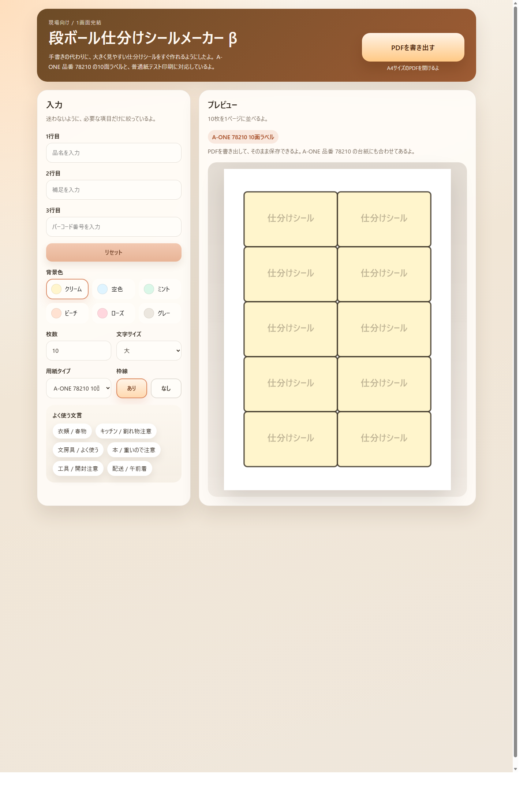

# danboru-shiwake-label-maker

段ボール仕分けラベルを簡単に作って、A4 / A-ONE 78210向けにPDF書き出しできるシンプルなツールだよ。

年上のスタッフでも迷わず使えることを優先して、1画面で完結する形にしているよ。

## 特長

- `index.html` を開くだけで使えるよ
- 1行目、2行目、3行目の文字を入力できるよ
- 背景色、枠線、枚数、標準の文字サイズを選べるよ
- A4 10面ラベルに合わせたプレビューを見ながら確認できるよ
- PDFを書き出して、そのまま保存できるよ

## 対応しているラベル

- A-ONE 78210
- 10面
- 86.4 x 50.8mm
- A4 210 x 297mm

## 使い方

1. [index.html](./index.html) をブラウザで開くよ
2. 品名、補足、バーコード番号などを入力するよ
3. 背景色や枠線を必要に応じて選ぶよ
4. `PDFを書き出す` を押すよ
5. 開いたPDF画面から保存するよ

## こんな使い方を想定しているよ

- 1行目: 商品名
- 2行目: サイズや補足
- 3行目: バーコード番号や管理番号

## 使うときの注意

- β版なので、最初の1枚は普通紙で位置合わせを見ると安心だよ
- 印刷時は `実際のサイズ` または `100%` を使うのがおすすめだよ
- `ページに合わせる` は使わないほうがズレにくいよ

## 動作方針

- まずはPC利用を前提にしているよ
- ログインやクラウド保存は入っていないよ
- 外部通信なしの静的HTML 1ファイル構成だよ
